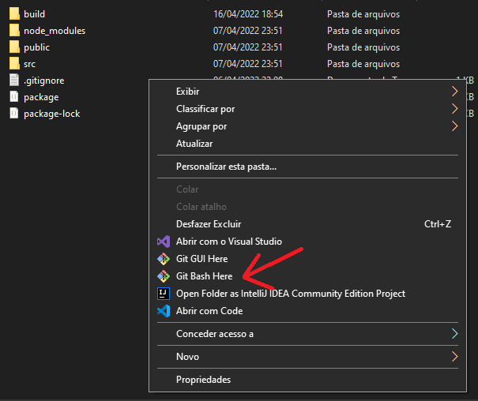

# Pagina Leads V3
Formulario cadastro de contatos 
---
- ##  Definição do projeto
    - Nome : Pagina Leads Royal Enfield
    - Descrição : Formulario simples para captacão de leads nas redes socias, enviando dados para e-mail.
    - Objetivo : Facilitar a captura de contatos para vendas de motos nas redes socias 
- ## Requisitos do projeto 
    - ### Definição da tecnologia
        1. Javascript (Liguagem)
        2. HTML5
        3. CSS3
        4. ReactJS (Framework JS)
    - ### Requisitos 
        1. Ter instalado em sua máquina as seguintes ferramentas: Gitbash, NodeJS e um navegador para visualização
               
---
- ## Executar projeto 
- ###  Projeto Disponivel na rede atraves o link abaixo :

     https://contato-royal.netlify.app/

- ### Execute o projeto local no seu pc : 

 1. Clone este repositorio em sua maquina utilizando o gitbash:
 
``` 
git clone "https://github.com/giovanesantiago/PagLeads-ReactV3.git"
```

2. Abra o Gitbash dentro da pasta do projeto :
 


3. Digite o codigo abaixo e execute :
```
npm start
```


